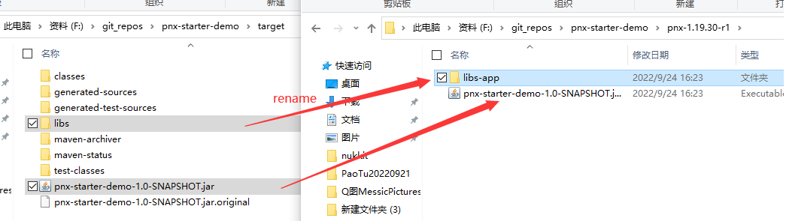
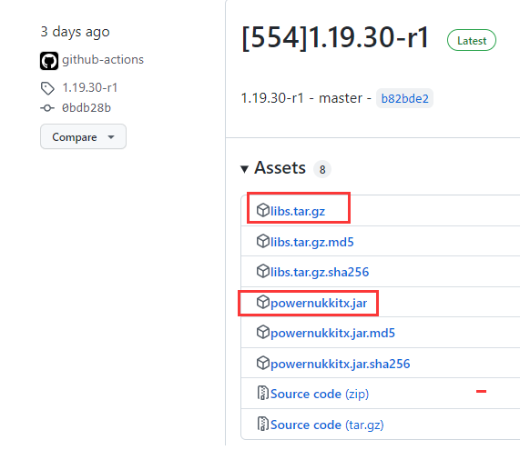
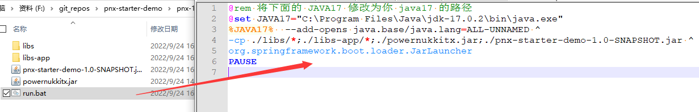

# pnx-starter-demo


`pnx-spring-boot-starter` 有两种方式进行开发，区别在于一个是嵌入式，一个是非嵌入式。  

嵌入式即打包后，所有三方依赖存在于 `jar` 包内部，更新 `pnx` 核心的时候，就要重新打包。  

非嵌入式则是把所有依赖放在 `jar` 包外部，启动时指定三方依赖的位置，需要更换 `pnx` 核心时，就只需要更新 `pnx` 依赖。


### 环境

`JDK17+` `SpringBoot 2.7`

### 编译和运行

#### 嵌入式 Embed

嵌入式参考 `pom-embed.xml` 配置，配置很简单 

```shell
# 打包
mvn clean package
# 运行
cd target
java -jar --add-opens java.base/java.lang=ALL-UNNAMED pnx-starter-demo-1.0-SNAPSHOT.jar
```


#### 非嵌入式 Non-Embed

非嵌入式参考 `pom.xml` 配置  

  
a. 创建一个空文件夹 ，例如： `pnx-1.19.30-r1`  

`pnx-1.19.30-r1` 下面继续创建文件夹 `libs-app` 和 `libs` 。  

b. 打包  

```
mvn clean package
```

c. 将打包生成的 `target/libs`  复制到 `pnx-1.19.30-r1/libs-app` ，  

将 `target/pnx-starter-demo-1.0-SNAPSHOT.jar` 复制到 `pnx-1.19.30-r1/pnx-starter-demo-1.0-SNAPSHOT.jar`   



d. 从  [Releases · PowerNukkitX/PowerNukkitX · GitHub](https://github.com/PowerNukkitX/PowerNukkitX/releases)  下载 `libs.tar.gz` 和 `powernukkitx.jar` 。  

将 `libs.tar.gz` 解压后得到的 `libs` 文件夹复制到 `pnx-1.19.30-r1/libs` ，  

将 `powernukkitx.jar` 复制到 `pnx-1.19.30-r1/powernukkitx.jar`  



e. 启动脚本  

其他的附加参数请参考 **pnx 给出的[参数](https://github.com/PowerNukkitX/PowerNukkitX#%E4%BD%BF%E7%94%A8%E6%AD%A5%E9%AA%A4)**

 `pnx-1.19.30-r1/run.bat`

```batch
@rem 将下面的 JAVA17 修改为你 java17 的路径
@set JAVA17="C:\Program Files\Java\jdk-17.0.2\bin\java.exe"
%JAVA17%  --add-opens java.base/java.lang=ALL-UNNAMED ^
-cp ./libs/*;./libs-app/*;./powernukkitx.jar;./pnx-starter-demo-1.0-SNAPSHOT.jar ^
org.springframework.boot.loader.JarLauncher
PAUSE

```

`pnx-1.19.30-r1/run.sh`

```sehll
# 将下面的 JAVA17 修改为你 java17 的路径
set JAVA17="C:\Program Files\Java\jdk-17.0.2\bin\java.exe"
$JAVA17  --add-opens java.base/java.lang=ALL-UNNAMED \
-cp ./libs/*:./libs-app/*:./powernukkitx.jar:./pnx-starter-demo-1.0-SNAPSHOT.jar \
org.springframework.boot.loader.JarLauncher

```



更换 `pnx` 核心只需要更换 `pnx-1.19.30-r1/powernukkitx.jar` 和 `pnx-1.19.30-r1/libs` 即可。


#### 修改服务配置

第一次运行后，修改 `server.properties` 中三条配置，然后重启服务器。

```properties
use-terra=on
xbox-auth=off
check-login-time=off
```

否则可能会提示你 `过期的服务器`。

### 注意

1. （重要）日志文件配置(`log4j2-spring.xml`)，根据需要自行配置。所有的日志输出已经被修改， server.log 不会再保存任何信息。此外， `nukkit` 的颜色代码也不会生效。
2. （可选）启动类继承 `NukkitApplicationLauncher` 类。
3. （重要）请勿在 `nukkit` 启动完成前获取 `nukkit` 内部的对象（不会真有人这么干吧）。

### 插件

插件目录是 `nsplugins` ，运行后自动生成， `nukkit` 原生插件目录是 `plugins` 。  

有关插件的开发和使用，请移步到  
[nsplugin-doc.md](https://github.com/WanneSimon/pnx-spring-boot-starter/blob/main/nsplugin-doc.mdhttps://github.com/WanneSimon/pnx-spring-boot-starter/blob/main/nsplugin-doc.md)
[pnx-starter-plugin-demo](https://github.com/WanneSimon/pnx-starter-plugin-demo)
